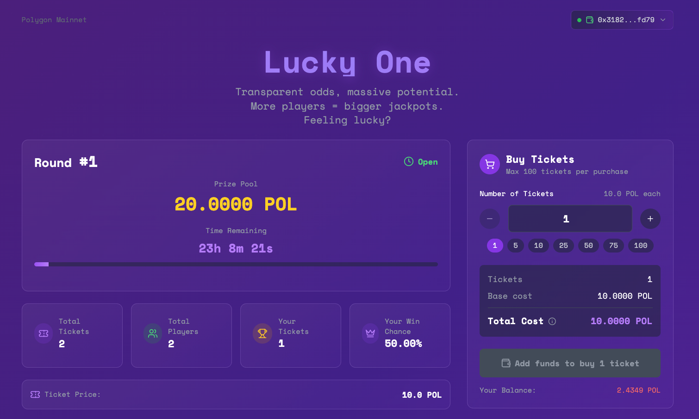

<div align="center">

```
░██                       ░██                                                      
░██                       ░██                                                      
░██ ░██    ░██  ░███████  ░██    ░██░██    ░██     ░███████  ░████████   ░███████  
░██ ░██    ░██ ░██    ░██ ░██   ░██ ░██    ░██    ░██    ░██ ░██    ░██ ░██    ░██ 
░██ ░██    ░██ ░██        ░███████  ░██    ░██    ░██    ░██ ░██    ░██ ░█████████ 
░██ ░██   ░███ ░██    ░██ ░██   ░██ ░██   ░███    ░██    ░██ ░██    ░██ ░██        
░██  ░█████░██  ░███████  ░██    ░██ ░█████░██     ░███████  ░██    ░██  ░███████  
                                          ░██                                     
                                    ░███████                                      
```

# LuckyOne - Decentralized Lottery

**A provably fair decentralized lottery system built with Solidity, React, and Chainlink VRF v2.**

[](https://opensource.org/licenses/MIT)
[](https://polygon.technology/)
[](https://chain.link/)

</div>

## 🎯 Current Status

**✅ LIVE ON POLYGON MAINNET**
- **Contract**: `0x65C7F3cB0F1DA3d7566e28d49F995c30d5F75ec0`
- **Network**: Polygon Mainnet (Chain ID: 137)
- **Ticket Price**: 10 POL per ticket
- **Lottery Duration**: 24 hours per round

## 📸 Screenshots

### Web Application
<div align="center">


*Main lottery dashboard with real-time status and ticket purchasing*

</div>

## 🚀 Quick Start

### Prerequisites
- Node.js 16+
- MetaMask wallet
- POL tokens for ticket purchases

### Installation
```bash
# Clone and install
git clone <repository-url>
cd lottery
npm install

# Install frontend dependencies
cd packages/app && npm install
```

### Usage

#### Web Application
```bash
npm run app
```
Then visit http://localhost:5173 and connect your MetaMask wallet.

#### CLI Commands
```bash
# Check lottery status
npm run status

# Buy tickets (example: 5 tickets)
TICKETS=5 npm run buy-tickets

# Claim prize (if you won round 1)
npm run claim-prize

# Check your participation
ADDRESS=0xfadoe34j3rh... npm run player-info
```

## 🎰 How It Works

### Lottery Mechanics
- **Ticket Sales**: Purchase 1-100 tickets per transaction
- **Fair Selection**: Chainlink VRF ensures provably random winner selection
- **Auto Rounds**: Everyone can end the round and the next one start automatically
- **Prize Pool**: Winner receives the accumulated ticket sales (minus fees)

### Progressive Fee Structure
- **First 100 tickets**: 0% fee
- **Tickets 101-1000**: 2.5% fee
- **Tickets 1001+**: 5% fee

Fees are deducted when prizes are claimed, keeping the system transparent.

## 📱 Features

### Web Application
- Real-time lottery status and countdown
- Wallet integration with network switching
- Ticket purchasing with fee calculation
- Prize claiming for winners
- Complete lottery history
- Mobile-responsive design

### CLI Tools
- Status checking with dynamic fee display
- Ticket purchasing with confirmation prompts
- Prize claiming functionality
- Lottery history viewing
- Player statistics

## 🏗️ Project Structure

```
lottery/
├── packages/
│   ├── app/           # React frontend
│   └── cli/           # Command-line tools
├── docs/              # Documentation
├── hardhat.config.js  # Blockchain configuration
└── package.json       # Main scripts
```

### Available Scripts
```bash
# Frontend
npm run app              # Start web application
npm run app:build        # Build for production

# Lottery Interaction
npm run status           # Check lottery status
npm run buy-tickets      # Buy lottery tickets
npm run claim-prize      # Claim winnings
npm run player-info      # Check your stats
npm run end-lottery      # End current round (when expired)

# Owner Functions
npm run withdraw-fees    # Withdraw accumulated fees (owner only)

# Development
npm run compile          # Compile smart contracts
npm run test             # Run test suite
npm run deploy           # Deploy to Polygon mainnet
```

## 🔒 Security Features

- **ReentrancyGuard**: Prevents reentrancy attacks
- **Access Controls**: Owner-only functions for emergencies
- **Input Validation**: Comprehensive parameter checking
- **Chainlink VRF**: Tamper-proof randomness generation
- **Transparent Fees**: All fee calculations are public

## 🌐 Network Details

- **Blockchain**: Polygon Mainnet
- **Contract Address**: `0x65C7F3cB0F1DA3d7566e28d49F995c30d5F75ec0`
- **Block Explorer**: [View on PolygonScan](https://polygonscan.com/address/0x65C7F3cB0F1DA3d7566e28d49F995c30d5F75ec0)
- **Chainlink VRF**: [Subscription Management](https://vrf.chain.link/polygon)

## 📚 Documentation

- **[CLI Guide](docs/CLI_GUIDE.md)**: Complete guide to all CLI commands
- **[Technical Guide](docs/TECHNICAL_GUIDE.md)**: Smart contract implementation details

## 🛠️ Development

### Environment Setup
```bash
# Copy environment template
cp .env.example .env

# Required variables:
PRIVATE_KEY=your_wallet_private_key
POLYGON_RPC_URL=https://polygon-rpc.com
ETHERSCAN_API_KEY=your_etherscan_api_key
```

## 📄 License

MIT License - see LICENSE file for details.

## ⚠️ Disclaimer

This is a decentralized application. Users interact directly with smart contracts at their own risk. Always verify contract addresses and understand the risks of blockchain interactions.

---

**🎲 Ready to play?** Visit the web app or use CLI commands to participate in the lottery!