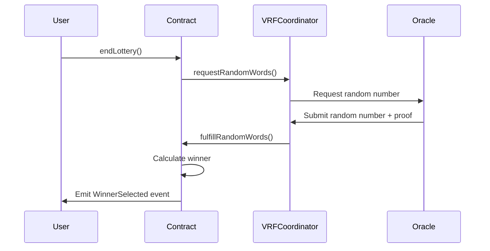
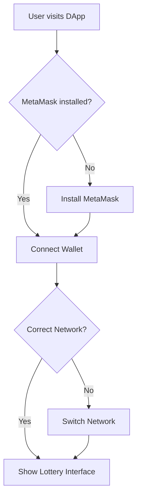
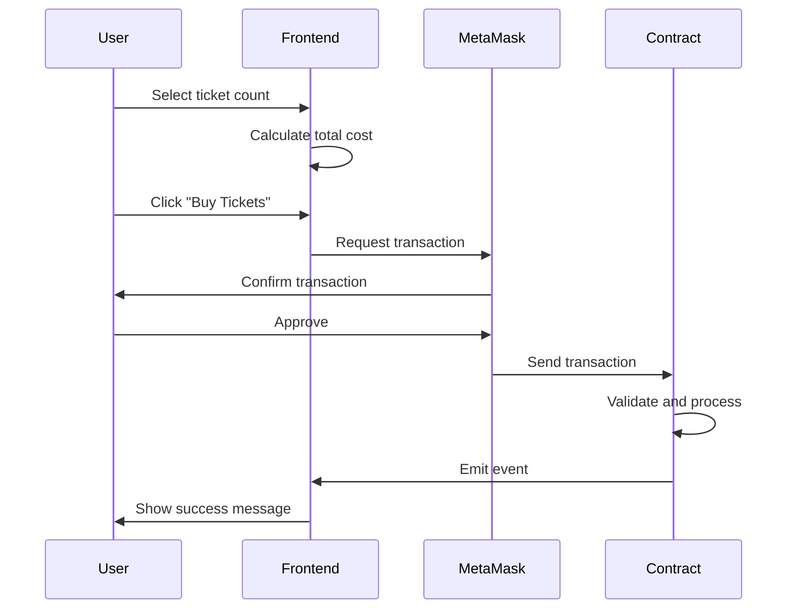
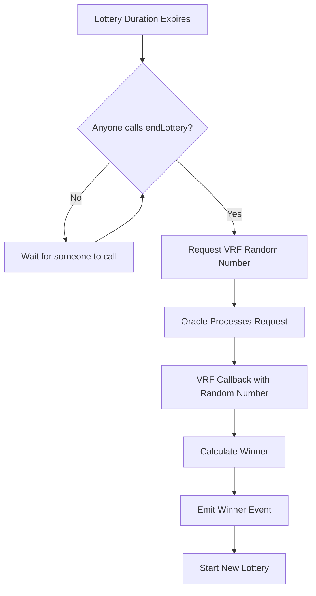
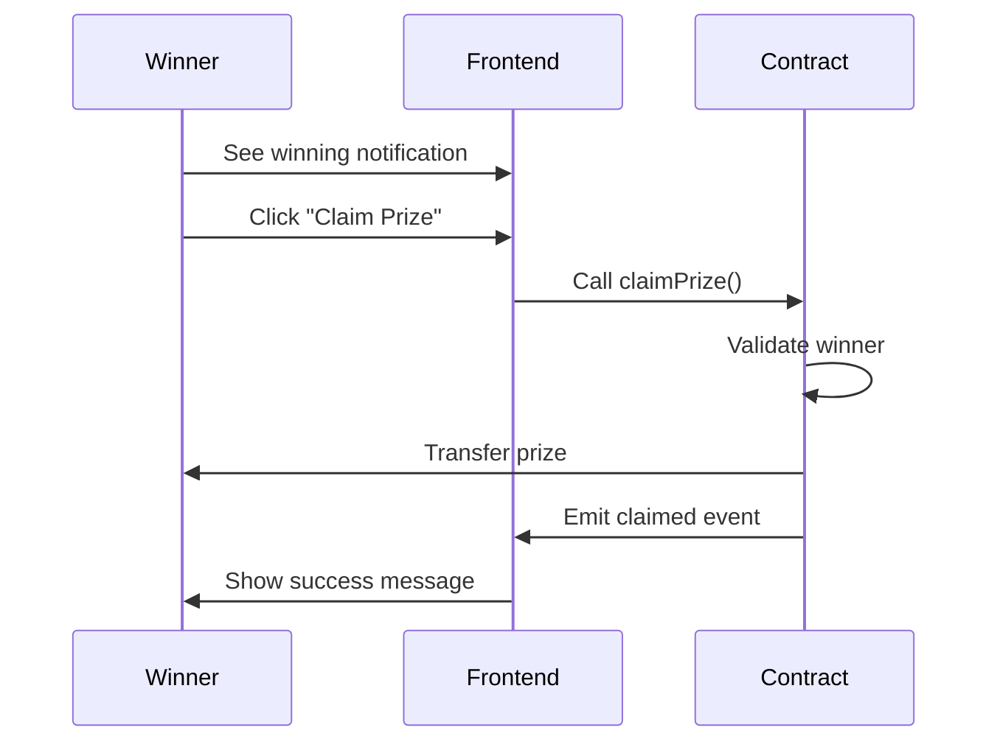

# Decentralized Lottery DApp: Complete Technical Guide

## Table of Contents
1. [System Overview](#system-overview)
2. [Architecture](#architecture)
3. [Smart Contract Deep Dive](#smart-contract-deep-dive)
4. [Chainlink VRF Integration](#chainlink-vrf-integration)
5. [Randomness Generation Process](#randomness-generation-process)
6. [Frontend Integration](#frontend-integration)
7. [Deployment Process](#deployment-process)
8. [Security Considerations](#security-considerations)
9. [Testing and Development](#testing-and-development)
10. [User Flow](#user-flow)
11. [Gas Optimization](#gas-optimization)
12. [Future Enhancements](#future-enhancements)

---

## System Overview

### What is this DApp?

The Decentralized Lottery DApp is a blockchain-based lottery system that ensures fairness through:
- **Provable randomness** using Chainlink VRF (Verifiable Random Function)
- **Transparent operations** with all transactions on-chain
- **Automated prize distribution** with smart contract execution
- **Decentralized governance** with no central authority controlling outcomes

### Key Features

1. **7-day lottery rounds** with automatic rollover
2. **0.01 ETH ticket price** (configurable)
3. **Up to 100 tickets per purchase** limit
4. **Proportional winning chances** based on ticket ownership
5. **Manual prize claiming** by winners
6. **Emergency withdrawal** for contract owner
7. **Real-time updates** through event monitoring

---

## Architecture

### System Components

```
┌─────────────────┐    ┌─────────────────┐    ┌─────────────────┐
│                 │    │                 │    │                 │
│  React Frontend │◄──►│ Smart Contract  │◄──►│ Chainlink VRF   │
│                 │    │                 │    │                 │
└─────────────────┘    └─────────────────┘    └─────────────────┘
         │                       │                       │
         │                       │                       │
         ▼                       ▼                       ▼
┌─────────────────┐    ┌─────────────────┐    ┌─────────────────┐
│                 │    │                 │    │                 │
│   MetaMask      │    │   Ethereum      │    │   Oracle        │
│   Wallet        │    │   Blockchain    │    │   Network       │
│                 │    │                 │    │                 │
└─────────────────┘    └─────────────────┘    └─────────────────┘
```

### Technology Stack

**Smart Contract Layer:**
- Solidity 0.8.20
- OpenZeppelin libraries for security
- Chainlink VRF for randomness
- Hardhat development environment

**Frontend Layer:**
- React 18 with hooks
- Ethers.js for blockchain interaction
- Tailwind CSS for styling
- Vite for development and building

**Infrastructure:**
- Ethereum networks (Sepolia testnet, mainnet)
- Chainlink Oracle Network
- MetaMask wallet integration
- Alchemy/Infura RPC providers

---

## Smart Contract Deep Dive

### Contract Structure

```solidity
contract LuckyOne is VRFConsumerBaseV2, ReentrancyGuard {
    // VRF Configuration
    VRFCoordinatorV2Interface private immutable i_vrfCoordinator;
    bytes32 private immutable i_gasLane;
    uint64 private immutable i_subscriptionId;
    uint32 private immutable i_callbackGasLimit;
    
    // Lottery Parameters
    uint256 private constant TICKET_PRICE = 0.01 ether;
    uint256 private constant LOTTERY_DURATION = 7 days;
    uint256 private constant MAX_TICKETS_PER_PURCHASE = 100;
    
    // State Variables
    uint256 private s_currentRoundId;
    mapping(uint256 => LotteryRound) private s_lotteryRounds;
    mapping(uint256 => mapping(address => uint256)) private s_playerTickets;
}
```

### Key Data Structures

#### LotteryRound Struct
```solidity
struct LotteryRound {
    uint256 roundId;        // Unique identifier for the round
    uint256 startTime;      // When the round began
    uint256 endTime;        // When the round ends
    uint256 totalTickets;   // Total tickets sold
    uint256 prizePool;      // Total ETH in the prize pool
    address[] players;      // List of all players
    address winner;         // Winner address (set after VRF response)
    bool ended;            // Whether endLottery() was called
    bool prizeClaimed;     // Whether prize was claimed
    uint256 requestId;     // VRF request ID
}
```

#### LotteryState Enum
```solidity
enum LotteryState {
    OPEN,        // Players can buy tickets
    CALCULATING, // Waiting for VRF response
    CLOSED       // Winner selected, new round started
}
```

### Core Functions

#### 1. buyTickets()
```solidity
function buyTickets(uint256 ticketCount) external payable nonReentrant {
    require(ticketCount > 0 && ticketCount <= MAX_TICKETS_PER_PURCHASE, "Invalid ticket count");
    require(msg.value == ticketCount * TICKET_PRICE, "Incorrect payment amount");
    
    LotteryRound storage currentRound = s_lotteryRounds[s_currentRoundId];
    require(block.timestamp < currentRound.endTime, "Lottery has ended");
    require(!currentRound.ended, "Lottery is closed");

    // Add player to players array if first purchase
    if (s_playerTickets[s_currentRoundId][msg.sender] == 0) {
        currentRound.players.push(msg.sender);
    }

    // Update player's ticket count and round totals
    s_playerTickets[s_currentRoundId][msg.sender] += ticketCount;
    currentRound.totalTickets += ticketCount;
    currentRound.prizePool += msg.value;

    emit TicketsPurchased(msg.sender, s_currentRoundId, ticketCount, msg.value);
}
```

**Security Features:**
- `nonReentrant` modifier prevents reentrancy attacks
- Exact payment validation prevents over/under payment
- Time-based validation ensures lottery is still open
- State validation prevents purchases after lottery ends

#### 2. endLottery()
```solidity
function endLottery() external {
    LotteryRound storage currentRound = s_lotteryRounds[s_currentRoundId];
    require(block.timestamp >= currentRound.endTime, "Lottery period not over");
    require(!currentRound.ended, "Lottery already ended");
    require(currentRound.totalTickets > 0, "No tickets sold");

    currentRound.ended = true;
    
    // Request random number from Chainlink VRF
    uint256 requestId = i_vrfCoordinator.requestRandomWords(
        i_gasLane,
        i_subscriptionId,
        REQUEST_CONFIRMATIONS,
        i_callbackGasLimit,
        NUM_WORDS
    );

    currentRound.requestId = requestId;
    s_requestIdToRoundId[requestId] = s_currentRoundId;

    emit LotteryEnded(s_currentRoundId, requestId);
}
```

**Process Flow:**
1. Anyone can call this function after lottery duration expires
2. Contract requests random number from Chainlink VRF
3. Lottery state changes to CALCULATING
4. System waits for VRF response

#### 3. fulfillRandomWords() - VRF Callback
```solidity
function fulfillRandomWords(uint256 requestId, uint256[] memory randomWords) internal override {
    uint256 roundId = s_requestIdToRoundId[requestId];
    LotteryRound storage round = s_lotteryRounds[roundId];

    // Calculate winning ticket using modulo
    uint256 winningTicket = randomWords[0] % round.totalTickets;
    address winner = _getWinnerFromTicket(roundId, winningTicket);
    
    round.winner = winner;
    
    emit WinnerSelected(roundId, winner, round.prizePool);
    
    _startNewLottery();
}
```

**Winner Selection Algorithm:**
```solidity
function _getWinnerFromTicket(uint256 roundId, uint256 winningTicket) private view returns (address) {
    LotteryRound storage round = s_lotteryRounds[roundId];
    uint256 ticketCount = 0;
    
    // Iterate through players and their ticket counts
    for (uint256 i = 0; i < round.players.length; i++) {
        address player = round.players[i];
        ticketCount += s_playerTickets[roundId][player];
        
        // If winning ticket falls within this player's range
        if (winningTicket < ticketCount) {
            return player;
        }
    }
    
    revert("Winner calculation failed");
}
```

**Example:** If Alice has 3 tickets and Bob has 2 tickets:
- Tickets 0, 1, 2 belong to Alice
- Tickets 3, 4 belong to Bob
- Random number 384732 % 5 = 2 → Alice wins

#### 4. claimPrize()
```solidity
function claimPrize(uint256 roundId) external nonReentrant validRound(roundId) {
    LotteryRound storage round = s_lotteryRounds[roundId];
    require(round.winner == msg.sender, "Not the winner");
    require(!round.prizeClaimed, "Prize already claimed");
    require(round.winner != address(0), "Winner not selected yet");

    round.prizeClaimed = true;
    uint256 prizeAmount = round.prizePool;

    // Transfer prize using low-level call
    (bool success, ) = payable(msg.sender).call{value: prizeAmount}("");
    require(success, "Prize transfer failed");

    emit PrizeClaimed(roundId, msg.sender, prizeAmount);
}
```

**Security Features:**
- Only winner can claim prize
- Prevents double-claiming
- Uses low-level call with success check
- Follows checks-effects-interactions pattern

---

## Chainlink VRF Integration

### Why Chainlink VRF?

Traditional random number generation on blockchain has several problems:
1. **Predictability**: Block hashes can be influenced by miners
2. **Manipulation**: Validators can withhold blocks to influence outcomes
3. **Transparency**: Need provable randomness for trust

Chainlink VRF solves these issues by providing:
- **Verifiable randomness** with cryptographic proofs
- **Tamper-proof** random numbers
- **On-chain verification** of randomness

### VRF Configuration

```solidity
// VRF Parameters
VRFCoordinatorV2Interface private immutable i_vrfCoordinator;
bytes32 private immutable i_gasLane;          // Gas lane (key hash)
uint64 private immutable i_subscriptionId;   // Subscription ID
uint32 private immutable i_callbackGasLimit; // Gas limit for callback
uint16 private constant REQUEST_CONFIRMATIONS = 3; // Block confirmations
uint32 private constant NUM_WORDS = 1;        // Number of random words
```

### VRF Subscription Model

1. **Create Subscription**: Register with VRF Coordinator
2. **Fund Subscription**: Add LINK tokens for payments
3. **Add Consumer**: Authorize contract to use subscription
4. **Request Random Words**: Make VRF requests
5. **Receive Callback**: Get random numbers via callback

### Gas Lane Selection

Gas lanes determine speed and cost:
- **Fast Lane**: Higher gas price, faster response
- **Standard Lane**: Balanced speed and cost
- **Slow Lane**: Lower gas price, slower response

For Sepolia testnet: `0x474e34a077df58807dbe9c96d3c009b23b3c6d0cce433e59bbf5b34f823bc56c`

### VRF Request Process



---

## Randomness Generation Process

### Step-by-Step Breakdown

#### 1. Request Initialization
```solidity
uint256 requestId = i_vrfCoordinator.requestRandomWords(
    i_gasLane,                 // Gas lane for pricing
    i_subscriptionId,          // Subscription ID
    REQUEST_CONFIRMATIONS,     // Block confirmations (3)
    i_callbackGasLimit,        // Gas limit for callback (500,000)
    NUM_WORDS                  // Number of random words (1)
);
```

#### 2. Oracle Processing
- Oracle receives request
- Generates random number using secure methods
- Creates cryptographic proof
- Submits to VRF Coordinator

#### 3. On-Chain Verification
- VRF Coordinator verifies the proof
- Ensures randomness is legitimate
- Calls `fulfillRandomWords()` on contract

#### 4. Winner Calculation
```solidity
uint256 winningTicket = randomWords[0] % round.totalTickets;
```

### Randomness Quality

**Entropy Sources:**
- Hardware random number generators
- Atmospheric noise
- Quantum processes
- Multiple oracle nodes

**Cryptographic Proof:**
- Uses secp256k1 elliptic curve
- Provides mathematical proof of randomness
- Verifiable on-chain

**Security Guarantees:**
- Unpredictable: Cannot be predicted in advance
- Uniform: All outcomes equally likely
- Tamper-proof: Cannot be manipulated
- Verifiable: Can be verified by anyone

---

## Frontend Integration

### React Application Structure

```
src/
├── components/
│   ├── WalletConnection.jsx    # MetaMask integration
│   ├── LotteryStatus.jsx       # Display lottery info
│   ├── TicketPurchase.jsx      # Buy tickets interface
│   └── WinnerDisplay.jsx       # Show past winners
├── hooks/
│   ├── useWallet.js           # Wallet connection logic
│   └── useContract.js         # Contract interaction
├── utils/
│   ├── contractABI.js         # Contract ABI and config
│   └── helpers.js             # Utility functions
└── App.jsx                    # Main application
```

### Wallet Integration

#### MetaMask Connection
```javascript
const connectWallet = async () => {
  if (window.ethereum) {
    try {
      const accounts = await window.ethereum.request({
        method: 'eth_requestAccounts'
      });
      
      const provider = new ethers.BrowserProvider(window.ethereum);
      const signer = await provider.getSigner();
      
      setAccount(accounts[0]);
      setSigner(signer);
    } catch (error) {
      console.error('Connection failed:', error);
    }
  }
};
```

#### Network Validation
```javascript
const checkNetwork = async () => {
  const chainId = await window.ethereum.request({ method: 'eth_chainId' });
  const expectedChainId = '0x' + NETWORK_CONFIG.chainId.toString(16);
  
  if (chainId !== expectedChainId) {
    setIsCorrectNetwork(false);
    return false;
  }
  
  setIsCorrectNetwork(true);
  return true;
};
```

### Contract Interaction

#### Reading Contract Data
```javascript
const loadLotteryData = async () => {
  const currentRoundId = await contract.getCurrentRoundId();
  const roundData = await contract.getLotteryRound(currentRoundId);
  
  const [
    roundId,
    startTime,
    endTime,
    totalTickets,
    prizePool,
    winner,
    ended,
    prizeClaimed,
    state
  ] = roundData;
  
  setLotteryData({
    roundId,
    startTime,
    endTime,
    totalTickets,
    prizePool,
    winner,
    ended,
    prizeClaimed,
    state
  });
};
```

#### Executing Transactions
```javascript
const buyTickets = async (ticketCount, ticketPrice) => {
  const value = ticketPrice * BigInt(ticketCount);
  
  try {
    const tx = await contract.buyTickets(ticketCount, { value });
    const receipt = await tx.wait();
    
    // Transaction successful
    console.log('Tickets purchased:', receipt.transactionHash);
    
    // Refresh UI
    await loadLotteryData();
  } catch (error) {
    console.error('Purchase failed:', error);
    throw error;
  }
};
```

### Event Monitoring

#### Real-time Updates
```javascript
const listenToEvents = useCallback(() => {
  if (!contract) return;
  
  // Listen for ticket purchases
  contract.on('TicketsPurchased', (player, roundId, ticketCount, totalCost) => {
    console.log(`${player} bought ${ticketCount} tickets`);
    loadLotteryData();
  });
  
  // Listen for winner selection
  contract.on('WinnerSelected', (roundId, winner, prizeAmount) => {
    console.log(`Winner selected: ${winner}`);
    loadLotteryData();
  });
  
  // Cleanup on unmount
  return () => {
    contract.removeAllListeners();
  };
}, [contract]);
```

#### Historical Data
```javascript
const loadPastWinners = async () => {
  const winnerLogs = await contract.queryFilter('WinnerSelected');
  
  const winners = await Promise.all(
    winnerLogs.slice(-10).map(async (log) => {
      const { roundId, winner, prizeAmount } = log.args;
      const roundData = await contract.getLotteryRound(roundId);
      
      return {
        roundId,
        winner,
        prizeAmount,
        prizeClaimed: roundData[7]
      };
    })
  );
  
  setPastWinners(winners);
};
```

---

## Deployment Process

### Development Environment Setup

#### 1. Hardhat Configuration
```javascript
module.exports = {
  solidity: {
    version: "0.8.20",
    settings: {
      optimizer: {
        enabled: true,
        runs: 200
      }
    }
  },
  networks: {
    hardhat: {
      chainId: 31337,
      accounts: {
        count: 10,
        accountsBalance: "10000000000000000000000"
      }
    },
    sepolia: {
      url: process.env.SEPOLIA_RPC_URL,
      accounts: [process.env.PRIVATE_KEY],
      chainId: 11155111
    }
  }
};
```

#### 2. Environment Variables
```bash
# .env file
SEPOLIA_RPC_URL=https://eth-sepolia.g.alchemy.com/v2/YOUR-API-KEY
PRIVATE_KEY=your-private-key-here
ETHERSCAN_API_KEY=your-etherscan-api-key
VRF_SUBSCRIPTION_ID=123
```

### Local Development

#### 1. Start Local Network
```bash
npx hardhat node
```

#### 2. Deploy to Local Network
```bash
npx hardhat run scripts/deploy.js --network localhost
```

#### 3. Mock VRF Setup
```javascript
// For local testing, deploy mock VRF coordinator
const VRFCoordinatorV2Mock = await ethers.getContractFactory("VRFCoordinatorV2Mock");
const vrfCoordinatorV2Mock = await VRFCoordinatorV2Mock.deploy(
  ethers.parseEther("0.1"), // base fee
  ethers.parseUnits("1", "gwei") // gas price link
);

// Create and fund subscription
const txResponse = await vrfCoordinatorV2Mock.createSubscription();
await vrfCoordinatorV2Mock.fundSubscription(1, ethers.parseEther("1"));
```

### Testnet Deployment

#### 1. Sepolia Testnet Setup
```bash
# Deploy to Sepolia
npx hardhat run scripts/deploy.js --network sepolia

# Verify contract
npx hardhat verify --network sepolia CONTRACT_ADDRESS "constructor-args"
```

#### 2. VRF Subscription Setup
1. Go to [vrf.chain.link](https://vrf.chain.link)
2. Create new subscription
3. Fund with LINK tokens
4. Add deployed contract as consumer

### Production Deployment

#### 1. Mainnet Considerations
- **Gas optimization**: Thorough testing of gas costs
- **Security audit**: Professional security review
- **LINK funding**: Adequate LINK for VRF requests
- **Monitoring**: Set up alerts for contract events

#### 2. Deployment Verification
```bash
# Verify all functions work
npx hardhat test --network mainnet

# Check VRF subscription
npx hardhat run scripts/checkVRF.js --network mainnet
```

---

## Security Considerations

### Smart Contract Security

#### 1. Reentrancy Protection
```solidity
modifier nonReentrant() {
    require(!_entered, "ReentrancyGuard: reentrant call");
    _entered = true;
    _;
    _entered = false;
}
```

**Why needed:**
- Prevents malicious contracts from calling back
- Protects fund transfers
- Essential for `buyTickets()` and `claimPrize()`

#### 2. Access Control
```solidity
modifier onlyOwner() {
    require(msg.sender == s_owner, "Not the contract owner");
    _;
}
```

**Controls:**
- Only owner can call emergency functions
- Ownership transfer requires explicit action
- No backdoors for lottery manipulation

#### 3. Input Validation
```solidity
require(ticketCount > 0 && ticketCount <= MAX_TICKETS_PER_PURCHASE, "Invalid ticket count");
require(msg.value == ticketCount * TICKET_PRICE, "Incorrect payment amount");
```

**Validations:**
- Ticket count limits
- Exact payment amounts
- Round ID validation
- Time-based checks

#### 4. State Management
```solidity
enum LotteryState {
    OPEN,        // Can buy tickets
    CALCULATING, // Waiting for VRF
    CLOSED       // Winner selected
}
```

**Benefits:**
- Clear state transitions
- Prevents invalid operations
- Consistent behavior

### Common Attack Vectors

#### 1. Front-Running
**Problem**: Miners can see transactions and place their own first

**Mitigation**:
- Fixed ticket price prevents manipulation
- Random selection makes front-running useless
- Time-based lottery reduces impact

#### 2. Block Manipulation
**Problem**: Miners might manipulate block timestamps

**Mitigation**:
- Uses Chainlink VRF for randomness
- Block timestamp only for lottery duration
- Multiple block confirmations

#### 3. Gas Limit Attacks
**Problem**: Contract might run out of gas

**Mitigation**:
- Efficient winner selection algorithm
- Reasonable gas limits
- Chunked operations where possible

#### 4. Economic Attacks
**Problem**: Large players might dominate

**Mitigation**:
- Ticket purchase limits
- Proportional winning chances
- Fair distribution mechanism

### Best Practices Implemented

1. **Use OpenZeppelin libraries**: Tested and audited code
2. **Explicit state management**: Clear contract states
3. **Event emission**: Transparent operations
4. **Error handling**: Meaningful error messages
5. **Gas optimization**: Efficient data structures
6. **Access control**: Proper permission management
7. **Fail-safe mechanisms**: Emergency withdrawal
8. **External dependency security**: Chainlink VRF integration

---

## Testing and Development

### Test Structure

```
test/
├── LuckyOne.test.js     # Main contract tests
├── fixtures/                       # Test fixtures
└── utils/                          # Test utilities
```

### Test Categories

#### 1. Unit Tests
```javascript
describe("Ticket Purchase", function () {
  it("Should allow valid ticket purchase", async function () {
    const ticketCount = 5;
    const ticketPrice = await lottery.getTicketPrice();
    const totalCost = ticketPrice * BigInt(ticketCount);
    
    await lottery.buyTickets(ticketCount, { value: totalCost });
    
    const userTickets = await lottery.getPlayerTickets(owner.address, 1);
    expect(userTickets).to.equal(ticketCount);
  });
  
  it("Should reject invalid payment", async function () {
    await expect(
      lottery.buyTickets(1, { value: ethers.parseEther("0.02") })
    ).to.be.revertedWith("Incorrect payment amount");
  });
});
```

#### 2. Integration Tests
```javascript
describe("VRF Integration", function () {
  it("Should select winner correctly", async function () {
    // Setup: Buy tickets
    await lottery.buyTickets(3, { value: ethers.parseEther("0.03") });
    
    // Fast forward time
    await network.provider.send("evm_increaseTime", [7 * 24 * 60 * 60]);
    await network.provider.send("evm_mine");
    
    // End lottery
    await lottery.endLottery();
    
    // Mock VRF response
    const requestId = await lottery.getCurrentRoundId();
    await vrfCoordinator.fulfillRandomWords(requestId, [12345]);
    
    // Check winner
    const roundData = await lottery.getLotteryRound(1);
    expect(roundData[5]).to.not.equal(ethers.ZeroAddress);
  });
});
```

#### 3. Gas Tests
```javascript
describe("Gas Optimization", function () {
  it("Should use reasonable gas for ticket purchase", async function () {
    const tx = await lottery.buyTickets(1, { value: ethers.parseEther("0.01") });
    const receipt = await tx.wait();
    
    expect(receipt.gasUsed).to.be.below(100000);
  });
});
```

### Testing Commands

```bash
# Run all tests
npx hardhat test

# Run specific test file
npx hardhat test test/LuckyOne.test.js

# Run tests with gas reporting
REPORT_GAS=true npx hardhat test

# Run tests with coverage
npx hardhat coverage
```

### Mock Setup for Local Testing

```javascript
// Mock VRF Coordinator for testing
const VRFCoordinatorV2Mock = await ethers.getContractFactory("VRFCoordinatorV2Mock");
const vrfCoordinator = await VRFCoordinatorV2Mock.deploy(
  ethers.parseEther("0.1"), // base fee
  ethers.parseUnits("1", "gwei") // gas price link
);

// Create subscription
const subscriptionTx = await vrfCoordinator.createSubscription();
const subscriptionReceipt = await subscriptionTx.wait();
const subscriptionId = subscriptionReceipt.events[0].args.subId;

// Fund subscription
await vrfCoordinator.fundSubscription(subscriptionId, ethers.parseEther("1"));
```

---

## User Flow

### Complete User Journey

#### 1. Wallet Connection


#### 2. Ticket Purchase Flow


#### 3. Lottery End Process


#### 4. Prize Claiming


### UI/UX Considerations

#### 1. Real-time Updates
- WebSocket connections for live data
- Event listeners for contract changes
- Automatic refresh of lottery status
- Loading states for transactions

#### 2. Error Handling
- Clear error messages
- Transaction failure explanations
- Network connectivity issues
- MetaMask errors

#### 3. Mobile Responsiveness
- Touch-friendly interfaces
- Responsive grid layouts
- Mobile wallet integration
- Optimized for small screens

---

## Gas Optimization

### Smart Contract Optimizations

#### 1. Storage Optimization
```solidity
// Packed struct to save gas
struct LotteryRound {
    uint256 roundId;        // 32 bytes
    uint256 startTime;      // 32 bytes
    uint256 endTime;        // 32 bytes
    uint256 totalTickets;   // 32 bytes
    uint256 prizePool;      // 32 bytes
    address winner;         // 20 bytes
    bool ended;            // 1 byte
    bool prizeClaimed;     // 1 byte
    uint256 requestId;     // 32 bytes
}
```

#### 2. Function Optimizations
```solidity
// Use immutable for constants
VRFCoordinatorV2Interface private immutable i_vrfCoordinator;
bytes32 private immutable i_gasLane;
uint64 private immutable i_subscriptionId;

// Efficient loops
function _getWinnerFromTicket(uint256 roundId, uint256 winningTicket) private view returns (address) {
    LotteryRound storage round = s_lotteryRounds[roundId];
    uint256 ticketCount = 0;
    
    for (uint256 i = 0; i < round.players.length; i++) {
        ticketCount += s_playerTickets[roundId][round.players[i]];
        if (winningTicket < ticketCount) {
            return round.players[i];
        }
    }
    revert("Winner calculation failed");
}
```

#### 3. Event Optimization
```solidity
// Indexed parameters for efficient filtering
event TicketsPurchased(
    address indexed player,
    uint256 indexed roundId,
    uint256 ticketCount,
    uint256 totalCost
);
```

### Gas Cost Analysis

| Function | Gas Cost | Optimization |
|----------|----------|-------------|
| `buyTickets(1)` | ~80,000 | Optimized storage |
| `buyTickets(10)` | ~85,000 | Batch processing |
| `endLottery()` | ~150,000 | VRF request |
| `claimPrize()` | ~60,000 | Efficient validation |

### Frontend Optimizations

#### 1. Batch Requests
```javascript
// Batch multiple contract calls
const multicall = async () => {
  const [roundId, ticketPrice, duration] = await Promise.all([
    contract.getCurrentRoundId(),
    contract.getTicketPrice(),
    contract.getLotteryDuration()
  ]);
  
  return { roundId, ticketPrice, duration };
};
```

#### 2. Efficient Event Filtering
```javascript
// Use indexed parameters for filtering
const filter = contract.filters.TicketsPurchased(userAddress);
const events = await contract.queryFilter(filter, -1000); // Last 1000 blocks
```

---

## Future Enhancements

### Potential Improvements

#### 1. Multiple Prize Tiers
```solidity
struct PrizeTier {
    uint256 percentage;  // Percentage of prize pool
    uint256 positions;   // Number of winners
}

mapping(uint256 => PrizeTier[]) private s_prizeTiers;
```

#### 2. Dynamic Ticket Pricing
```solidity
function calculateTicketPrice(uint256 totalTickets) public pure returns (uint256) {
    // Implement dynamic pricing based on demand
    return BASE_PRICE + (totalTickets * PRICE_MULTIPLIER);
}
```

#### 3. Lottery Variations
- **Time-based**: Different durations
- **Threshold-based**: End when ticket limit reached
- **Multi-token**: Accept different ERC-20 tokens
- **NFT prizes**: Award NFTs instead of ETH

#### 4. Advanced Features
- **Referral system**: Reward user referrals
- **Staking mechanism**: Stake tokens for better odds
- **Governance**: Community voting on parameters
- **Cross-chain**: Multi-chain lottery system

### Technical Enhancements

#### 1. Layer 2 Integration
```solidity
// Polygon/Arbitrum deployment
contract L2LuckyOne {
    // Lower gas costs
    // Faster transactions
    // Same security guarantees
}
```

#### 2. Automated Operations
```solidity
// Chainlink Automation for automatic lottery ending
contract AutomatedLottery {
    function checkUpkeep(bytes calldata) external view returns (bool, bytes memory);
    function performUpkeep(bytes calldata) external;
}
```

#### 3. Enhanced Security
- **Multi-sig wallet**: Multiple owners
- **Timelock**: Delayed critical operations
- **Pausable**: Emergency pause functionality
- **Upgradeable**: Proxy pattern for upgrades

---

## Conclusion

This decentralized lottery DApp demonstrates several key blockchain development concepts:

1. **Smart Contract Architecture**: Modular, secure, and efficient design
2. **Randomness Generation**: Chainlink VRF for provable fairness
3. **Frontend Integration**: Modern React application with Web3
4. **Security Best Practices**: Comprehensive protection mechanisms
5. **Gas Optimization**: Efficient resource utilization
6. **Testing Strategy**: Comprehensive test coverage
7. **Deployment Process**: Multi-environment deployment

The system provides a fair, transparent, and decentralized lottery experience while maintaining security and user experience. The architecture is scalable and can be extended with additional features as needed.

### Key Takeaways

- **Randomness is critical**: Never rely on blockchain-native randomness
- **Security first**: Implement comprehensive security measures
- **User experience matters**: Smooth frontend integration is essential
- **Gas optimization**: Critical for user adoption and costs
- **Testing is crucial**: Comprehensive testing prevents bugs
- **Documentation helps**: Clear documentation aids development

This technical guide serves as a comprehensive reference for understanding and building decentralized lottery applications on Ethereum.